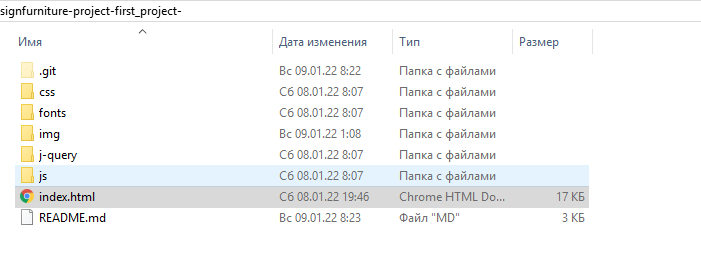

# 1. *Дизайнерская Мебель*

## Описание проекта
***Абсолютно каждый человек хочет жить в комфорте! И наша мебель создаётся именно для вас!!!***

## 2. Как запустить наш проект?
___

1. Склонируйте шаблон одной командой (команда выкачает только нужные файлы, Readme.md и .git будут игнорированы):

<pre>https://github.com/Jacepwnce/designfurniture-project-first_project-.git</pre>
 
 2. Загрузите архив с вёрсткой путём нажатия кнопки "Download ZIP":
   

3. Распаковать скаченный архив и открыть файл index.html:
   

   ## 3. Использованные технологии
   ___
   - HTML - использован для создания разметки сайта
 - CSS - использован для стилизации сайта
 - БЭМ - технология Блок, Элемент, Модификатор.
 - [jQuery](https://jquery.com/) - Использован для работы Burger-Menu. (version: 3.6.0)
 - JavaScript - использован для придания сайту функциональности
 - Swiper (https://swiperjs.com/) - использован для создания слайдеров на сайте
 - Burger-Menu - было выполнено по видео из YouTube и скорректировано под проект. Оно используется под расширения: **425px**, **375px**, **320px**. [Видео по которому сделано Burger-Menu](https://www.youtube.com/watch?v=chJQofBSx94&t=1116s).   
___
## 4. Адаптивность и функциональность

- Сайт полностью адаптирован для экранов: 1920px, 1440px, 1024px, 768px, 425px, 375px, 320px.
 - Тестирование проходило в браузере Chrome версии 97.0.4692.71 и Mozilla Firefox версии 95.0.2 (64 бита).
 - В витринных карточках товаров можно заменять картинки на другие
 - В файле index.js можно легко настроить слайдеры под себя.
___

